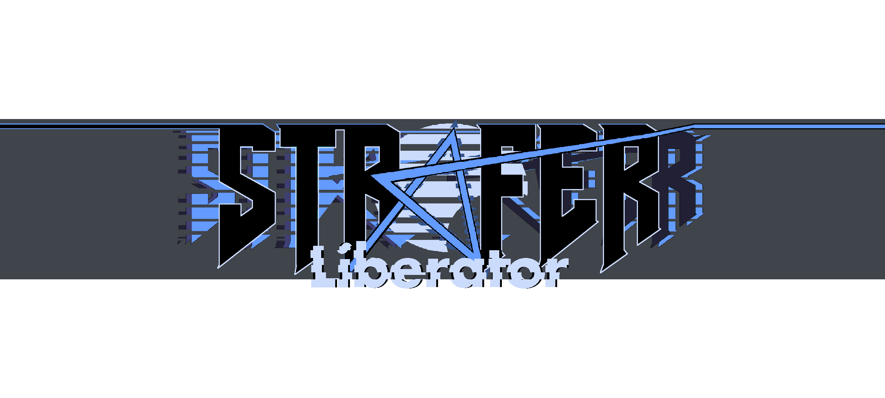
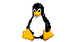

----------


# Instalare
- 

**Windows** 

**link download**

Folositi kit-ul de instalare, apoi rulati fisierul .exe


-  

**Linux / MacOS**

**link download**

Dezarhivati si rulati fisierul .jar din linia de comanda folosind:
```
java -jar desktop-1.0.jar
```

- 

**Android**

**link download**

instalati si rulati fisierul apk 

----------
# Portul 


Initial, Strafer a fost un joc de dimensiuni mici realizat in [Greenfoot](https://www.greenfoot.org/door). Datorita limitarilor tehnice impuse de Greenfoot si dorintei de a dezvolta jocul cat mai mult fara a face sacrificii, a fost luata decizia ca acesta sa fie portat, iar apoi extins de la codul sursa care deja exista. Pentru a realiza portul a fost folosit [libGDX](https://libgdx.com/) ce permite distribuirea cross platform a proiectului si puterea de a dezvolta un joc cat mai mare si complet posibil. Cu mici ajustari pachetul cu librariile greenfoot portate ar putea fi folosite standalone pentru a porta orice proiect realizat cu Greenfoot.


# Povestea


Strafer Liberator este un joc RPG, open-world, top-down 2D puternic inspirat de seriile "The Legend of Zelda" si "Earthbound", dar si de jocuri precum "Doom" si "God of War". 
In Strafer, jucatorul ia rolul unui astronaut, care s-a ratacit pe o planeta necunoscuta. Pentru a se intaorce acasa, este nevoit sa isi recupereze obiectele pierdute in timp ce descopera secretele planetei  pe care va trebui sa o elibereze.

# Lumea jocului


Lumea jocului este impartita in 6 sectiuni distincte intr-o maniera metroidvania ce ajuta la construirea graduala a povestii si care impinge player-ul sa exploreze. Parti din harta se deblocheaza odata cu descoperirea sectiunilor, pozitia jucatorului si a obiectivelor fiind indicate pe harta


# Gameplay


Gameplay loop-ul se imparte intre mai multe tipuri de activitati ale playerului  de-a lungul lumii de joc. Aceste activitati includ in principal explorarea, combat-ul, colectarea de iteme sau interactiunea cu NPC-uri si cutsceneuri sau tutoriale.

# Grafica / sunet

Exceptand cateva elemente de tilemap ce au fost adaptate, toate asseturile de la fundaluri, sprite ur, animatii si muzica au fost facute in-house.

# Salvari
La fel ca orice joc care se respecta, Strafer este capabil de a salva progresul jucatorului intre sesiunile de joc in fisier ce pot fi transferate.

# Detalii versiuni
*in afara de User interface nu au fost facute diferente intre desktop si mobile

|  \\_____________________________/ | Windows/Linux/MacOS|Android   |
|---|---|---|
  | Fullscreen |    da  |da   |
  |V-Sync|da|default unde este posibil|
| FPS (pe display-urile pe care a fost testat)  |   pana la 120|  pana la 90 |
| Input   |mouse&tastatura   | touchscreen / mouse&tastatura  |
[Documentatie Tehnica](https://github.com/KOTerra/StraferLiberator/tree/portGreenfoot/Documentatie)
