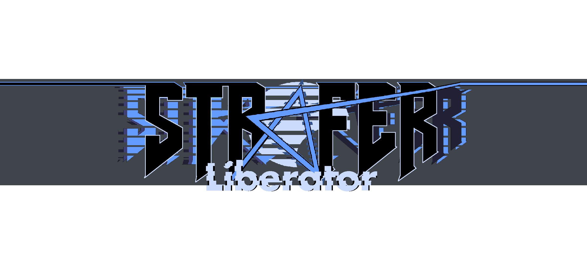

----------

# The Port

Initially, Strafer was a small-scale game created in [Greenfoot](https://www.greenfoot.org/door). Due to the technical limitations imposed by Greenfoot and the desire to develop the game as much as possible without making sacrifices, the decision was made to port it, and then extend it from the source code that already existed.

To achieve the port, libGDX ([libgdx.com/](https://libgdx.com/)) was used, which allows for cross-platform distribution of the project and provides the power to develop a game as large and complete as possible. With small adjustments, the package containing the ported Greenfoot libraries could be used standalone to port any project created with Greenfoot.

We participated with it in the "InfoEducatie" national olympiad for innovation and digital creativity (Romania). It won first place at the online qualifications and 6th place with mention at the national phase.

# The Story

Strafer Liberator is an RPG, open-world, top-down 2D game strongly inspired by "The Legend of Zelda" and "Earthbound" series, but also by games like "Doom" and "God of War".

In Strafer, the player takes on the role of an astronaut who has become stranded on an unknown planet. To return home, they are forced to recover their lost items while discovering the secrets of the planet that they will have to liberate.

# The Game World

The game world is divided into 6 distinct sections in a Metroidvania style, which helps in the gradual unfolding of the story and pushes the player to explore. Parts of the map unlock along with the discovery of the sections, with the player's position and objectives being indicated on the map.

# Gameplay

The gameplay loop is divided between several types of player activities throughout the game world. These activities mainly include:
- Exploration
- Combat
- Item Collection
- Interaction with NPCs, cutscenes, and tutorials

# Graphics / Sound

With the exception of a few tilemap elements that were adapted, all assets—from backgrounds, sprites, and animations to music—were made in-house.

# Saves

Like any self-respecting game, Strafer is capable of saving player progress between game sessions into files that can be transferred.

# Version Details

Apart from the User Interface, no differences were made between desktop and mobile.
|  \\_____________________________/ | Windows/Linux/MacOS|Android   |
|---|---|---|
  | Fullscreen |    yes  |yes   |
  |V-Sync|yes|default where possible |
| FPS (where tested)  |   up to 120|  up to 90 |
| Input   |mouse&keyboard   | touchscreen / mouse&tastatura  |

# (RO) Technical Documentation
[Documentatie Tehnica](https://github.com/KOTerra/StraferLiberator/tree/portGreenfoot/Documentatie/Dita/out)
